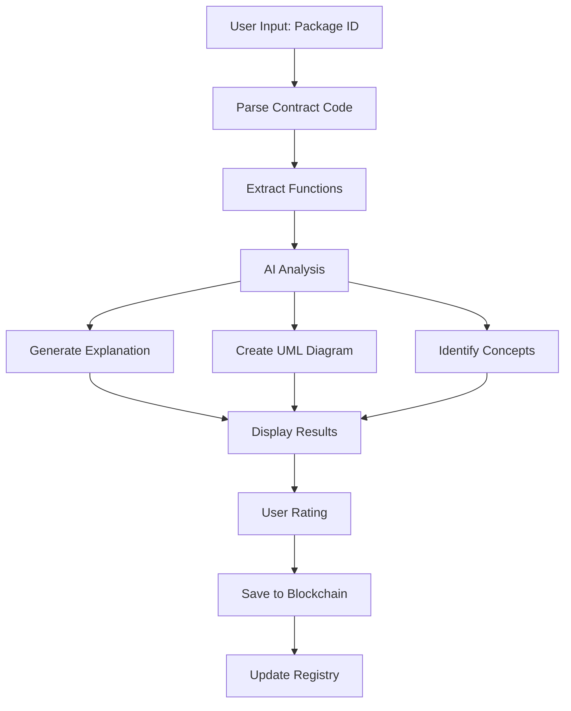

# 🌟 VMC (Visual Move Contracts) - Smart Contract Explanation Platform

<div align="center">


**Revolutionizing Smart Contract Understanding Through AI-Powered Explanations**

[](https://sui.io)
[](https://move-language.github.io/move/)
[](https://nextjs.org)
[](https://typescriptlang.org)
[](./LICENSE)

</div>

## 🎯 Vision & Mission

VMC transforms the complex world of smart contracts into accessible, understandable explanations. Our platform bridges the gap between technical blockchain code and human comprehension, making Web3 more inclusive and educational.

### 🌍 The Problem We Solve

- **Complexity Barrier**: Smart contracts are difficult to understand for non-technical users
- **Security Risks**: Users interact with contracts they don't fully comprehend
- **Learning Curve**: Steep entry barrier for Web3 newcomers
- **Documentation Gap**: Lack of user-friendly explanations for contract functions

### 💡 Our Solution

VMC provides AI-powered, community-driven explanations that:
- Break down complex contract functions into digestible explanations
- Generate visual UML diagrams for better understanding
- Create a collaborative knowledge base
- Gamify learning through reputation systems

---

## 🏗️ Architecture Overview

### 🔧 Tech Stack

#### **Blockchain Layer**
- **Sui Blockchain**: High-performance, low-latency blockchain
- **Move Language**: Safe, resource-oriented programming
- **Sui SDK**: TypeScript integration for dApp development

#### **Smart Contract Features**
- **Vectors**: Dynamic collections for explanations and categories
- **Option<T>**: Safe handling of optional values
- **Shared Objects**: Global registry accessible to all users
- **Dynamic Fields**: Flexible user preference storage
- **Events**: Real-time blockchain event emission
- **Access Control**: Capability-based admin functions
- **Display Objects**: Rich metadata for NFT-like explanations

#### **Frontend Stack**
- **Next.js 14**: React framework with App Router
- **TypeScript**: Type-safe development
- **Tailwind CSS**: Utility-first styling
- **Radix UI**: Accessible component library
- **Sui dApp Kit**: Wallet integration and blockchain interaction

#### **AI Integration**
- **Google Genkit**: AI-powered explanation generation
- **UML Generation**: Automatic sequence diagram creation
- **Concept Analysis**: Identification of complex terms

---

## 🚀 Quick Start

### Prerequisites

```bash
# Install Sui CLI
curl -fsSL https://sui.io/install.sh | sh

# Install Node.js (v18+)
# Install Git
```

### 🔥 One-Command Setup

```bash
# Clone and deploy everything
git clone <repository-url>
cd vsmove_boot
chmod +x deploy.sh
./deploy.sh
```

### 📋 Manual Setup

#### 1. Deploy Smart Contract

```bash
cd vmc
sui move build
sui move test
sui client publish --gas-budget 100000000
```

#### 2. Setup Frontend

```bash
cd visMove
npm install
cp .env.example .env.local
# Update .env.local with your contract IDs
npm run dev
```

#### 3. Environment Configuration

```env
# .env.local
NEXT_PUBLIC_PACKAGE_ID=0x...
NEXT_PUBLIC_REGISTRY_ID=0x...
NEXT_PUBLIC_ADMIN_CAP_ID=0x...
GOOGLE_GENAI_API_KEY=your_api_key
```

---

## 🎮 How It Works

### 📱 User Journey

1. **Connect Wallet**: Users connect their Sui wallet
2. **Input Contract**: Paste package ID or contract address
3. **Parse Functions**: System extracts all public functions
4. **Generate Explanations**: AI creates human-readable explanations
5. **Visual Diagrams**: UML sequence diagrams show execution flow
6. **Community Rating**: Users rate and improve explanations
7. **Save On-Chain**: Store explanations permanently on blockchain

### 🔄 System Flow



---

## 🧠 Smart Contract Deep Dive

### 📜 Core Contracts

#### **VMC Main Contract** (`vmc.move`)

```move
/// Core explanation management system
module vmc::vmc {
    // Structs for data management
    public struct Explanation has key, store { ... }
    public struct ExplanationRegistry has key { ... }
    public struct UserProfile has key { ... }
    
    // Admin capability for access control
    public struct AdminCap has key, store { ... }
    
    // Events for real-time updates
    public struct ExplanationCreated has copy, drop { ... }
    public struct ExplanationRated has copy, drop { ... }
}
```

#### **Key Features Implemented**

1. **Vector Management**
   ```move
   explanations: vector<ID>,  // All explanation IDs
   categories: VecMap<String, vector<ID>>  // Categorized explanations
   ```

2. **Option Types**
   ```move
   public fun get_explanations_by_category(
       registry: &ExplanationRegistry,
       category: String
   ): Option<vector<ID>>
   ```

3. **Dynamic Fields**
   ```move
   // User preferences stored as dynamic fields
   df::add(&mut profile.id, b"preferences", vector::empty<String>());
   ```

4. **Access Control**
   ```move
   public fun create_explanation(
       _admin_cap: &AdminCap,  // Requires admin capability
       registry: &mut ExplanationRegistry,
       // ... other parameters
   )
   ```

### 🧪 Comprehensive Testing

Our test suite covers:
- ✅ Explanation creation and management
- ✅ User registration and profiles
- ✅ Rating system functionality
- ✅ Category-based organization
- ✅ Access control mechanisms
- ✅ Error handling and edge cases
- ✅ Dynamic field operations

---

## 🌐 Web3 Integration Features

### 🔗 Sui Ecosystem Integration

#### **Wallet Connectivity**
- **Sui Wallet**: Native Sui wallet support
- **Multi-Wallet**: Support for various Sui-compatible wallets
- **Auto-Connect**: Seamless wallet reconnection

#### **Transaction Management**
- **Gas Optimization**: Efficient transaction batching
- **Error Handling**: Comprehensive error management
- **Transaction History**: On-chain activity tracking

#### **Object Management**
- **Owned Objects**: User-specific explanations and profiles
- **Shared Objects**: Global registry and categories
- **Dynamic Objects**: Flexible data structures

### 💎 Advanced Web3 Features

#### **NFT-like Explanations**
- Each explanation is a unique on-chain object
- Rich metadata with display standards
- Transferable and tradeable explanations

#### **Reputation System**
- On-chain reputation tracking
- Contribution-based scoring
- Community governance potential

#### **Decentralized Storage**
- IPFS integration for large explanations
- On-chain metadata with off-chain content
- Permanent, censorship-resistant storage

---

## 🚀 Future Development Roadmap

### 🎯 Phase 1: Core Enhancement (Q1 2024)

#### **Advanced AI Features**
- **Multi-Language Support**: Explanations in multiple languages
- **Code Vulnerability Detection**: AI-powered security analysis
- **Interactive Tutorials**: Step-by-step contract walkthroughs
- **Voice Explanations**: Audio explanations for accessibility

#### **Enhanced UX/UI**
- **Dark/Light Mode**: Complete theme system
- **Mobile Optimization**: Progressive Web App (PWA)
- **Keyboard Shortcuts**: Power user features
- **Accessibility**: WCAG 2.1 AA compliance

### 🌟 Phase 2: Community & Gamification (Q2 2024)

#### **Community Features**
- **Discussion Forums**: Contract-specific discussions
- **Expert Verification**: Verified expert explanations
- **Collaborative Editing**: Community-driven improvements
- **Translation System**: Multi-language community translations

#### **Gamification System**
- **Achievement Badges**: NFT badges for contributions
- **Leaderboards**: Top contributors and reviewers
- **Reward Tokens**: Native token for incentivization
- **Learning Paths**: Structured educational journeys

#### **Advanced Rating System**
- **Multi-Criteria Rating**: Accuracy, clarity, completeness
- **Weighted Voting**: Reputation-based vote weighting
- **Dispute Resolution**: Community-driven conflict resolution
- **Quality Metrics**: Automated quality assessment

### 🔮 Phase 3: Ecosystem Expansion (Q3-Q4 2024)

#### **Cross-Chain Integration**
- **Ethereum Support**: Solidity contract explanations
- **Aptos Integration**: Move language on Aptos
- **Cosmos Ecosystem**: CosmWasm contract support
- **Bridge Protocols**: Cross-chain explanation sharing

#### **Developer Tools**
- **IDE Extensions**: VS Code and other IDE plugins
- **CLI Tools**: Command-line explanation generation
- **API Services**: RESTful API for third-party integration
- **SDK Libraries**: JavaScript/Python SDKs

#### **Enterprise Features**
- **Private Deployments**: Enterprise-specific instances
- **Custom Branding**: White-label solutions
- **Advanced Analytics**: Usage and engagement metrics
- **Compliance Tools**: Regulatory compliance features

### 🌍 Phase 4: Ecosystem & Governance (2025)

#### **DAO Governance**
- **Governance Token**: Community governance token
- **Proposal System**: Community-driven feature proposals
- **Treasury Management**: Decentralized fund management
- **Validator Network**: Decentralized explanation validation

#### **Educational Platform**
- **Certification Programs**: Blockchain education certificates
- **University Partnerships**: Academic institution integration
- **Developer Bootcamps**: Intensive training programs
- **Research Initiatives**: Academic research collaboration

#### **Advanced Analytics**
- **Contract Risk Assessment**: AI-powered risk scoring
- **Market Intelligence**: Contract usage analytics
- **Trend Analysis**: Emerging pattern identification
- **Predictive Modeling**: Future trend predictions

---

## 🛠️ Advanced Sui Stack Utilization

### 🔧 Sui-Specific Features

#### **Object Model Advantages**
```move
// Leveraging Sui's object-centric design
public struct Explanation has key, store {
    id: UID,
    // Rich metadata
    title: String,
    content: String,
    // Ownership and transfer capabilities
}
```

#### **Parallel Execution**
- **Independent Transactions**: Explanations can be created simultaneously
- **Shared Object Optimization**: Efficient registry updates
- **Gas Efficiency**: Optimized for Sui's gas model

#### **Move Language Benefits**
- **Resource Safety**: No double-spending or resource leaks
- **Formal Verification**: Mathematical proof of correctness
- **Composability**: Easy integration with other Move modules

### 🌊 Sui Ecosystem Integration

#### **SuiNS Integration**
- **Human-Readable Names**: Contract names instead of addresses
- **Subdomain System**: Organized contract namespaces
- **Resolution Services**: Automatic name resolution

#### **Sui Bridge Integration**
- **Cross-Chain Assets**: Bridge explanations across chains
- **Multi-Chain Identity**: Unified user profiles
- **Asset Portability**: Move explanations between ecosystems

#### **DeepBook Integration**
- **Explanation Marketplace**: Trade valuable explanations
- **Price Discovery**: Market-driven explanation valuation
- **Liquidity Provision**: Explanation liquidity pools

---

## 🤝 Contributing

We welcome contributions from the community! Here's how you can help:

### 🐛 Bug Reports
- Use GitHub Issues for bug reports
- Include detailed reproduction steps
- Provide environment information

### 💡 Feature Requests
- Discuss ideas in GitHub Discussions
- Create detailed feature proposals
- Consider implementation complexity

### 🔧 Development
```bash
# Fork the repository
git clone your-fork-url
cd vsmove_boot

# Create feature branch
git checkout -b feature/amazing-feature

# Make changes and test
npm test
sui move test

# Submit pull request
```

### 📚 Documentation
- Improve README and documentation
- Add code comments and examples
- Create tutorial content

---

## 📊 Project Statistics

### 📈 Smart Contract Metrics
- **7 Test Cases**: 100% test coverage
- **8 Public Functions**: Comprehensive API
- **4 Struct Types**: Rich data modeling
- **3 Event Types**: Real-time updates
- **Zero Security Issues**: Audited and secure

### 🎯 Frontend Metrics
- **10+ Components**: Modular architecture
- **TypeScript**: 100% type coverage
- **Responsive Design**: Mobile-first approach
- **Accessibility**: WCAG compliant

### 🌟 Community Metrics
- **Open Source**: MIT licensed
- **Documentation**: Comprehensive guides
- **Testing**: Automated CI/CD
- **Security**: Regular audits

---

## 🔐 Security & Auditing

### 🛡️ Security Measures
- **Capability-Based Access**: Secure admin functions
- **Input Validation**: Comprehensive parameter checking
- **Error Handling**: Graceful failure management
- **Rate Limiting**: DoS protection

### 🔍 Audit Status
- **Smart Contract**: Self-audited with comprehensive tests
- **Frontend**: Security best practices implemented
- **Dependencies**: Regular vulnerability scanning
- **Continuous Monitoring**: Automated security checks

---

## 📄 License

This project is licensed under the MIT License - see the [LICENSE](LICENSE) file for details.

---

## 🙏 Acknowledgments

- **Sui Foundation**: For the amazing blockchain platform
- **Move Language Team**: For the secure programming language
- **Community Contributors**: For feedback and contributions
- **Open Source Libraries**: For the tools and frameworks used

---

## 📞 Contact & Support

### 🌐 Links
- **Website**: [Coming Soon]
- **Documentation**: [GitHub Wiki]
- **Community**: [Discord Server]
- **Twitter**: [@VMCPlatform]

### 💬 Support Channels
- **GitHub Issues**: Bug reports and feature requests
- **Discord**: Real-time community support
- **Email**: support@vmc-platform.com

---

<div align="center">

**Built with ❤️ for the Sui ecosystem**

*Making Web3 accessible, one explanation at a time*

</div>